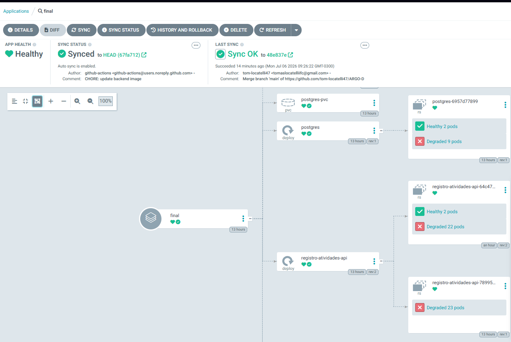

# Trabalho Final - Fundamentos de DevOps
**Aluno:** Tomas

---

## 1. Introdução
Este projeto teve como objetivo construir uma esteira automatizada de infraestrutura e deploy contínuo utilizando o modelo GitOps. Foi desenvolvida uma arquitetura capaz de provisionar, configurar e publicar uma aplicação de forma resiliente e automatizada.

* **Tecnologias utilizadas:** AWS, Terraform, Ansible, Kubernetes (K3s), Traefik e ArgoCD.

---

## 2. Escolha do Ambiente
* **Tipo de ambiente:** Nuvem pública (AWS Learner Lab).
* **Justificativa:** Uso de um ambiente de nuvem real de mercado integrado às ferramentas de automação e em total conformidade com as cotas do laboratório acadêmico.
* **Descrição das Instâncias:** Foram provisionadas 4 instâncias EC2 do tipo `t2.micro` utilizando o sistema operacional Ubuntu Server, organizadas em 1 nó Master e 3 nós Workers. (quando eu tentava cria com medium o meu aws matava a instancia por isso criaei com micro)

---

## 3. Provisionamento
* **Ferramentas:** Terraform para o design e criação da malha de rede (VPC, Subnets, Internet Gateway, Security Groups) e das instâncias EC2. Ansible para a configuração interna do sistema operacional, instalação de dependências e pacotes necessários.
* **Scripts:** Arquivos `.tf` de configuração na pasta de infraestrutura e receitas de automação YAML estruturadas dentro de `playbooks/`.
* **Desafios e Soluções:** Limitações de tipo de instância na AWS Academy exigiram o uso estrito de `t2.micro` (quando eu tentava cria com medium o meu aws matava a instancia por isso criaei com micro). 

---

## 4. Cluster Kubernetes
* ** OSERVAÇÃO: ** Como não consegui criar t3.medium para hospedar o cluster, acabei criando outra maquina na mão "Lord-Vader" e rodei o cluster nela 
* **Ferramenta de Instalação:** K3s 
* **Configuração dos Nós:** 
  * 1 nó *Control Plane* (Master)
  * 3 nós de trabalho (*Workers*)
* **Testes de Funcionamento:** Verificação de integridade realizada com sucesso via comando `kubectl get nodes`, com todos os nós respondendo em status `Ready`. A comunicação interna entre as subnets foi devidamente liberada via Security Groups na AWS.

---

## 5. GitOps com ArgoCD
* **Instalação:** Instalado diretamente no cluster Kubernetes dentro do namespace nativo do operador.
* **Configuração do Git:** Conectado diretamente ao repositório de manifestos declarativos `ARGO-DEVOPS-3`.
* **Deploy:** Sincronização automática e monitoramento do estado desejado da aplicação. Qualquer alteração ou commit feito na branch principal do repositório é instantaneamente refletida na AWS.
* *(Insira o print do painel do seu ArgoCD mostrando os recursos sincronizados em verde aqui)*

---

## 6. Aplicação
* **Descrição:** Aplicação Full Stack integrada contendo uma camada de Frontend, uma API de Backend (FastAPI) e um Banco de Dados relacional (PostgreSQL).

---

## 7. Conclusão
* O projeto não ficou 100%, o terraform, ansible, a sincronição do ArgoCd e o backend fuincionaram, porem não consegui acessar o frontend

---

## 8. Links para Repositórios
* **Infraestrutura e Código-Fonte:** [https://github.com/tom-locatelli47/registro-star-wars-revolta-dos-clones-devops](https://github.com/tom-locatelli47/registro-star-wars-revolta-dos-clones-devops)
* **Manifestos GitOps (ArgoCD):** [https://github.com/tom-locatelli47/ARGO-DEVOPS-3](https://github.com/tom-locatelli47/ARGO-DEVOPS-3)

